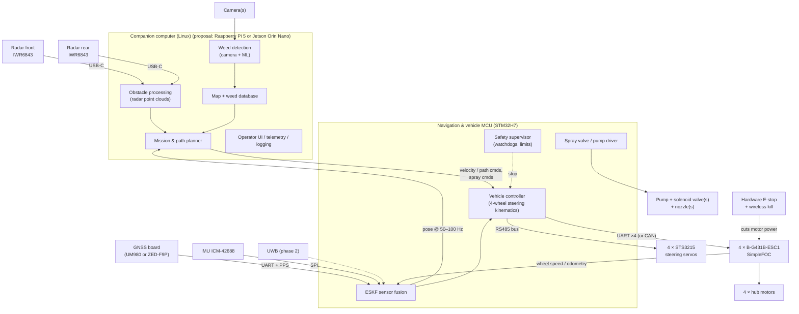

# System Architecture (draft)

> Status: **DRAFT v0.1, open for discussion.** This proposal combines the design notes in [`design/`](design/)
> and fills the gaps they leave open, mainly compute split, vision, spraying, power and safety.
> Anything marked **(proposal)** is a suggestion, not a decision. Open decisions are listed in
> [`design/open-questions.md`](design/open-questions.md).

## 1. Mission

An autonomous rover that drives around a private garden, **detects weeds with a camera and sprays them precisely**.
It must work under trees and along house walls, where GNSS is weak. Later it may also push tools such as a
grass trimmer.

## 2. Guiding principles

1. **Split by timing needs.** Anything that needs hard real-time timing (motor control, steering, IMU sampling,
   sensor fusion, safety) runs on STM32 microcontrollers. Heavy but less time-critical work (vision, radar
   processing, planning, maps, UI) runs on a Linux companion computer.
2. **Fail safe.** If a link or a computer stops responding, the rover stops and the spray valve closes. A hardware
   E-stop removes motor power no matter what the software does.
3. **Modules we can swap.** The navigation module has a clear interface (pose out), so phase 1 GNSS/ESKF can later be replaced
   by UWB or radar-aided versions without touching the rest.
4. **Start with dev kits** (Nucleo, B-G431B-ESC1, TI EVM, ArduSimple). Design our own PCBs only once the design works.

## 3. Block diagram



The link between the companion computer and the MCU is **Ethernet (UDP) or UART (proposal: Ethernet, since the
NUCLEO-H7S3L8 has it)**.

## 4. Subsystems

### 4.1 Companion computer (Linux)

| Task | Notes |
|---|---|
| Weed detection | Camera looking down or forward-down. A small detection or segmentation model (e.g. YOLO-class) trained on our own garden images. Output: weed positions in the camera frame, converted to garden coordinates using the pose. |
| Obstacle processing | Reads point clouds from both radars over USB, masks out the ground and sky (because of the 80° vertical FOV), and keeps a local obstacle grid. |
| Map & weed database | Map of the garden: boundaries, no-go zones, walls, lawn edges. Records each weed's position, when it was sprayed, and whether it needs re-checking. |
| Mission & path planner | Plans coverage routes, visits to known weeds, and wall and edge following. Sends motion commands to the MCU. |
| UI / telemetry | Web UI over Wi-Fi: live status, map, start/stop, logs. Records sensor logs for offline tuning. |

**Choice of computer (proposal):** start with a **Raspberry Pi 5** (+ AI accelerator if needed). Move to a **Jetson Orin Nano** if weed detection
needs more GPU. We need 2 USB ports for the radars and 1 camera interface.

**Framework (open):** ROS 2 gives drivers, rosbag logging, RViz and Nav2 for free, but it is heavy (see the JPL osr-rover-code).
A lighter option is plain Python with a small message bus. Decide before writing much code on the companion computer.

### 4.2 Navigation & vehicle MCU (STM32H7)

One STM32H7 board in phase 1 (proposal). It can be split in two later (a separate navigation module and vehicle
controller) when the self-contained navigation module becomes a thing.

- **ESKF:** predicts from the IMU at 200–400 Hz. Corrected by GNSS (1–10 Hz), wheel odometry and the
  no-sideways-slip constraint, and later UWB. Uses PPS for accurate GNSS timing.
- **Vehicle controller:** turns a body motion command (vx, vy, yaw rate) into a steering angle and wheel speed for
  each of the 4 wheels. Supports Ackermann, turn-on-the-spot and crab modes. Waits for the steering servos to reach
  their angles before driving hard.
- **Safety supervisor:** if no command comes from the companion computer within **200 ms (proposal)**, stop the
  rover and close the spray valve. Also enforces speed limits and checks ESC and servo faults.
- **Spray driver:** MOSFET outputs for the pump and solenoid valve(s). Timing is based on odometry, so the rover
  sprays when the nozzle is over the weed, not when the camera sees it.

### 4.3 Drivetrain

- 4 × hoverboard hub motors, each driven by a **B-G431B-ESC1 running SimpleFOC**.
- 4 × **Feetech STS3215** steering servos on one RS485 bus.
- See [design/mechanical-and-drive.md](design/mechanical-and-drive.md).

### 4.4 Spray system (not designed yet; proposal)

- A small 12 V diaphragm pump and a pressure-limited tank, feeding **one normally-closed solenoid valve per nozzle**.
- The nozzle(s) sit at a known, calibrated distance behind the camera's view.
- Phase 1: 1 nozzle, sprayed as the rover drives over the weed. Later: a row of nozzles, or a nozzle that can be aimed
  with a servo.
- Liquid: to be decided (herbicide, vinegar, or hot water or foam as alternatives). This affects which materials and seals we can use.

### 4.5 Power (not designed yet; proposal)

- **Main battery:** depends on the motor/ESC voltage question (36 V hoverboard motors vs. ESC max voltage, see open questions).
- DC/DC converters for **12 V** (pump, valves, servos: check servo voltage), **5 V** (companion computer, radars over USB-C)
  and **3.3 V** logic.
- The hardware E-stop cuts **motor power only**, so logging and telemetry keep running.
- Later: automatic docking and charging (see the [Watney](https://github.com/nikivanov/watney) reference).

## 5. Data flows and rates (targets)

| Signal | From → To | Rate | Link |
|---|---|---|---|
| IMU samples | ICM-42688 → STM32H7 | 200–400 Hz | SPI |
| GNSS position / velocity | GNSS → STM32H7 | 1–10 Hz (+ PPS) | UART |
| Wheel speed | ESC → STM32H7 | ≥ 50 Hz | UART/CAN |
| Steering angle feedback | Servos → STM32H7 | ≥ 20 Hz | RS485 |
| Pose estimate | STM32H7 → companion | 50–100 Hz | Ethernet/UART |
| Motion command | Companion → STM32H7 | 20–50 Hz (heartbeat) | Ethernet/UART |
| Radar point cloud | IWR6843 → companion | ~10–30 Hz | USB |
| Camera frames | Camera → companion | 10–30 fps | CSI/USB |

## 6. Coordinate frames

- **Garden frame (ENU):** a fixed local frame with its origin at a surveyed point, e.g. the RTK base station or a
  UWB anchor. Weeds and maps are stored in this frame.
- **Body frame:** origin at the rover's centre, x forward, y left, z up.
- **Sensor frames:** camera, radars, GNSS antenna and IMU each have a fixed, calibrated offset from the body frame.
  Keep these offsets in one config file.

## 7. Suggested software layout

```
software/
  control/      STM32 firmware: vehicle controller, safety supervisor, ESC/servo drivers
  navigation/   ESKF (prototyped in Python first, then C/C++ on STM32)    ← new (proposal)
  vision/       weed detection: dataset tools, training, inference
  spray/        spray timing logic and valve/pump driver
  companion/    planner, map, radar processing, UI                        ← new (proposal)
```

## 8. Phased roadmap (proposal)

| Phase | Goal | Done when |
|---|---|---|
| 0 | Bench tests | One hub motor spins under SimpleFOC; one servo moves; GNSS gives a fix; IMU streams |
| 1 | Remote-controlled rover | Chassis drives by remote control with 4-wheel steering; E-stop and watchdog work |
| 2 | Positioning | ESKF with GNSS + IMU + odometry; can repeat a route along a wall within the target accuracy |
| 3 | Obstacles | Radars mounted and calibrated; rover stops or steers around obstacles |
| 4 | Weeds | Weed detection works on our own images; spraying hits the target on a test lawn |
| 5 | Robust navigation | UWB anchors added; accuracy holds under trees and next to walls |
| Later | Self-contained navigation module | GNSS + IMU + Doppler radar + INS on Zephyr |
